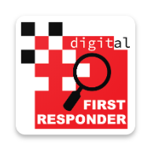
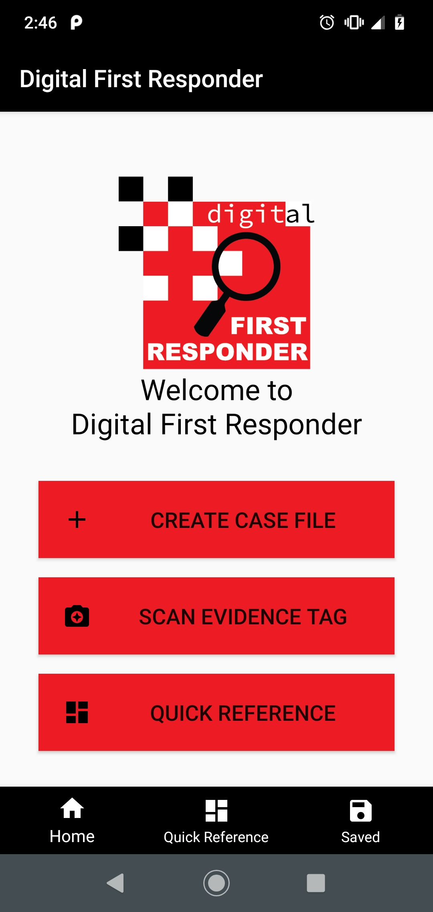

# Digital First Responder 

**Case Manager for on-scene Digital Forensics**

Digital First Responder allows a forensics examiner to accelerate their work on a scene.

Ingest information from a variety of common sources, print evidence labels, scan evidence labels, driver's licenses and documents.

# Development Overview

This is a Native Android application targeting SDK version 19 or higher (Android 4.4)

## Developer Setup

A full gradle project is provided but there are dependencies that are not bundled.
**Dependencies:** [Brother Print Library](https://developerprogram.brother-usa.com/sdk-download)
**Dependencies:** [Brother Core Library + Brother Scan Library](https://developerprogram.brother-usa.com/sdk-download)
